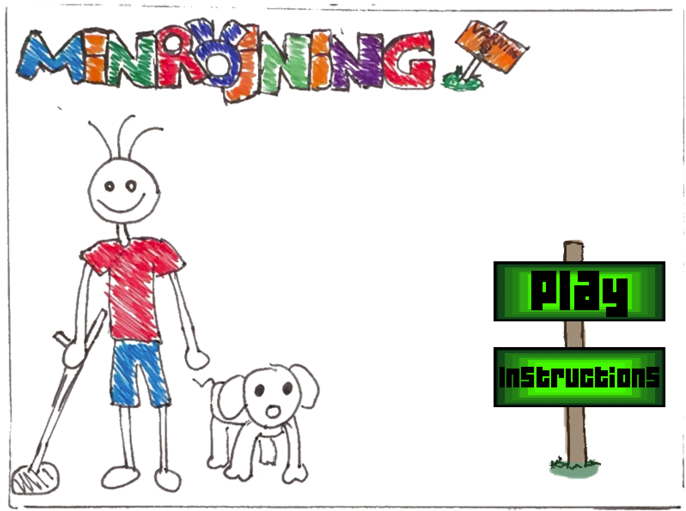
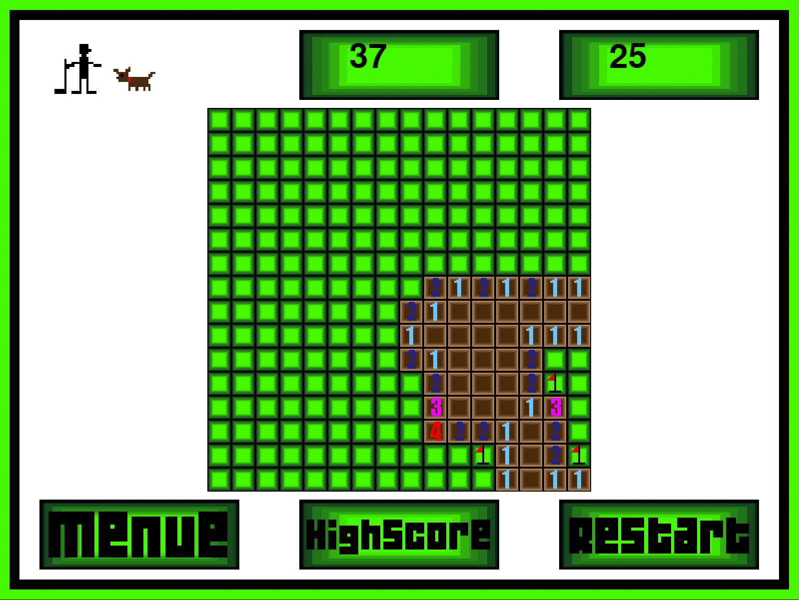
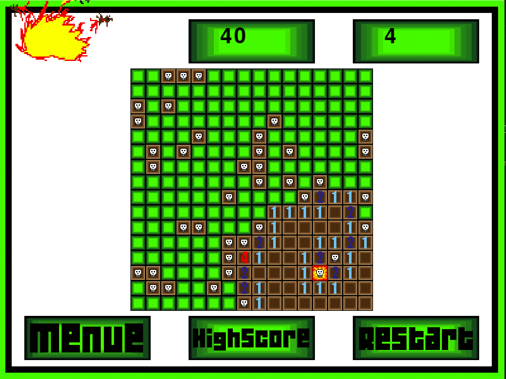

*Created in 2017*
# Minesweeper

 
 
## Instructions
#### On windows

Create virtual environment

```py -m venv [project_location]```

Activate virtual environment

```.\[project_location]\Scripts\activate```

Install pygame

```python -m pip install pygame```

Start game by running game.bat or running game.pyw


[Full guide on installing virtual environment in Python](https://packaging.python.org/guides/installing-using-pip-and-virtual-environments/ "Full guide on installing virtual environment in Python")

[Full guide on installing pygame](https://www.pygame.org/wiki/GettingStarted "Full guide on installing pygame")


## Screenshots
 

 
